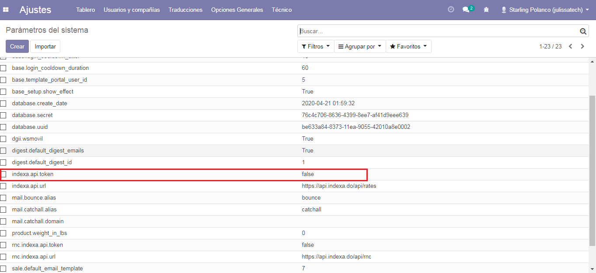

Contabilidad y Facturacion
==========================

Catalogo de Cuentas
-------------------

Catálogo de Cuentas e Impuestos para República Dominicana, Compatible para Internacionalización con NIIF y alineado a las normas y regulaciones de la Dirección General de Impuestos Internos (DGII).

      - Catálogo de Cuentas Estándar (alineado a DGII y NIIF)
      - Catálogo de Impuestos con la mayoría de Impuestos Preconfigurados
            - ITBIS para compras y ventas
            - Retenciones de ITBIS
            - Retenciones de ISR
            - Grupos de Impuestos y Retenciones:
                  - Telecomunicaiones
                  - Proveedores de Materiales de Construcción
                  - Personas Físicas Proveedoras de Servicios
            - Otros impuestos

En la configuración de Contabilidad desplace a la seccion **Localizacion Fiscal** vera un paquete prefoconfigurado del catalogo de cuentas dominicano que se le instalara de manera automatica, que están relacionados con el tipo de responsabilidad fiscal de la compañía.

.. image:: media/dominicana03.png
   :align: center

Comprobantes Fiscales
---------------------
En la configuracion de contabilidad selecione la opcion **Diario**, crear o editar el diario de ventas, escoja el Tipo de Diario > Ventas  luego active el **Control de NCF** luego haga click Generar NCF.

.. image:: media/dominicana09.PNG
   :align: center

Secuencias generadas de forma automatica.

.. image:: media/dominicana10.PNG
   :align: center

Declaraciones Fiscales
----------------------

Tasas de Banco Dominicanos
==========================

Para esto, ir  **Aplicaciones** y buscar **Dominican Banks Currency Update**. Luego haga clic en *Instalar*.

.. image:: media/dominicana04.png
   :align: center

Configuraciones 
---------------

En la configuracion de contabilidad desplace hasta la seccion **Monedas** active la función de Multi-Divisa luego Configure los parámetros de tasas de su banco dominicano como banco, intervalo, base y compensación.

.. image:: media/dominicana05.png
   :align: center

Configuraciones técnicas
------------------------

Debe configurar su clave API para autenticarse con el servicio externo.
* Vaya a Configuración> Técnico> Parámetros> Parámetros del sistema
* Establezca su clave en el valor de registro de parámetro `indexa.api.token`

Puede configurar el momento en que se ejecutará su acción de actualización de moneda

* Vaya a Configuración> Automatización> Acciones programadas

.. image:: media/dominicana07.png
   :align: center

* Haga clic en **[TASAS] Actualizar Tasas** cron
* Establezca su hora en la próxima fecha de ejecución

.. image:: media/dominicana08.png
   :align: center

Notas
-----
No cambie ningún otro campo **Acciones programadas**. Su cron debe ejecutarse diariamente, incluso si sus parámetros **Tasas de Banco Dominicano** no lo hacen.

Uso
---
Sus **Acciones programadas** recuperarán sus tasas bancarias de la API dada en los intervalos que configure en su configuración.

