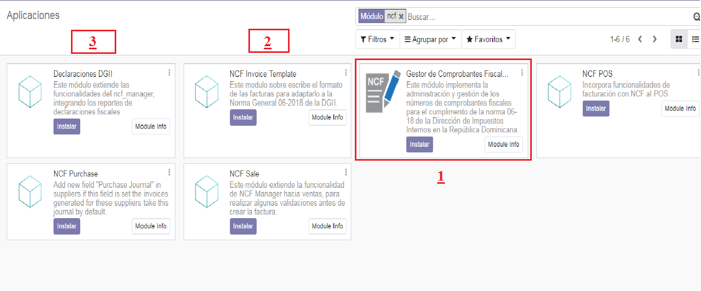

Instalar Modulo
=============

Instalar los modulos de la localizacion
---------------------------------------

Para esto, ir  **Aplicaciones** y busca **ncf**. Luego haga clic en **Instalar** el modulo ``ncf_manager`` despues los demas modulos que lo complementan.  ``ncf_invoice_template`` > ``ncf_sale`` > ``ncf_purchase`` y por ultimo ``ncf_pos`` instale este si requiere
utilizar el punto de venta.

Configurar Compañía
-------------------

Una vez que los módulos están instalados, el primer paso es configurar los datos de su empresa. Además de
información básica, un campo clave es **(RNC/NIF)**:

.. image:: media/dominicana02.png
   :align: center